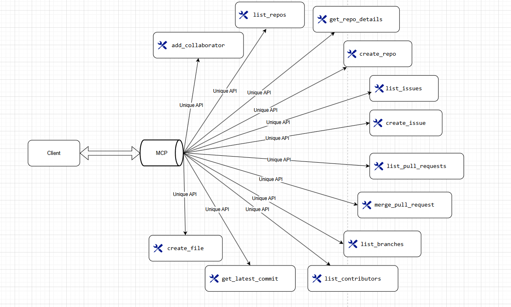

# GitHub MCP Server

## What is MCP Server?
MCP (Model Context Protocol) is an open protocol that standardizes how applications provide context to LLMs. Think of MCP like a USB-C port for AI applications - it provides a standardized way to connect AI models to different data sources and tools.
## GitHub MCP Server Architecture


---

## 📥 Cloning the Repository
To get started, clone this repository using:
```sh
git clone repo link
cd foldername
```

---

## 🔧 Setup Instructions
You can set up the project using **pip** or **uv**. Choose one of the methods below.

### **Method 1: Using pip**
```sh
python -m venv venv
source venv/bin/activate  # On Windows use `venv\Scripts\activate`
pip install -r requirements.txt
```
### **Method 2: Using uv (Fast Dependency Manager)**
### Note: You can install [uv](https://docs.astral.sh/uv/) from here.
```sh
uv venv
source .venv/bin/activate  # On Windows use `.venv\Scripts\activate`
uv pip install -r requirements.txt
```

---

## 🔑 Setting Up Environment Variables
Create a `.env` file and add the following credentials:
```ini
GITHUB_ACCESS_TOKEN=your_github_personal_access_token
GITHUB_API_URL=https://api.github.com
```

---

## 🚀 Running the MCP Server in browser
It can directly expose endpoints on browser and there you can run every endpoint manually 
```sh
mcp dev server.py
```
Output:
```sh
🔍 MCP Inspector is up and running at http://localhost:5173 🚀
```

---

### claude setup
->First download claude desktop and login.
->open settings and go to develper settings and click on edit config it will redirect to filemanager and open claude_desktop_config this file in any notepad or vs code
```sh
{
    "mcpServers": {
        "GithubMCP": {
            "command": "C:/Users/MAHIREDDY/.local/bin/uv",
            "args": [
                "--directory",
                "C:/Users/MAHIREDDY/Desktop/2025Leanrings/Agents_and_automations/mcp/GithubMCP",
                "run",
                "main.py"
            ]
        }
    }
}
```
->now restart the claude using task manager and then test it out with your mcp server
---


